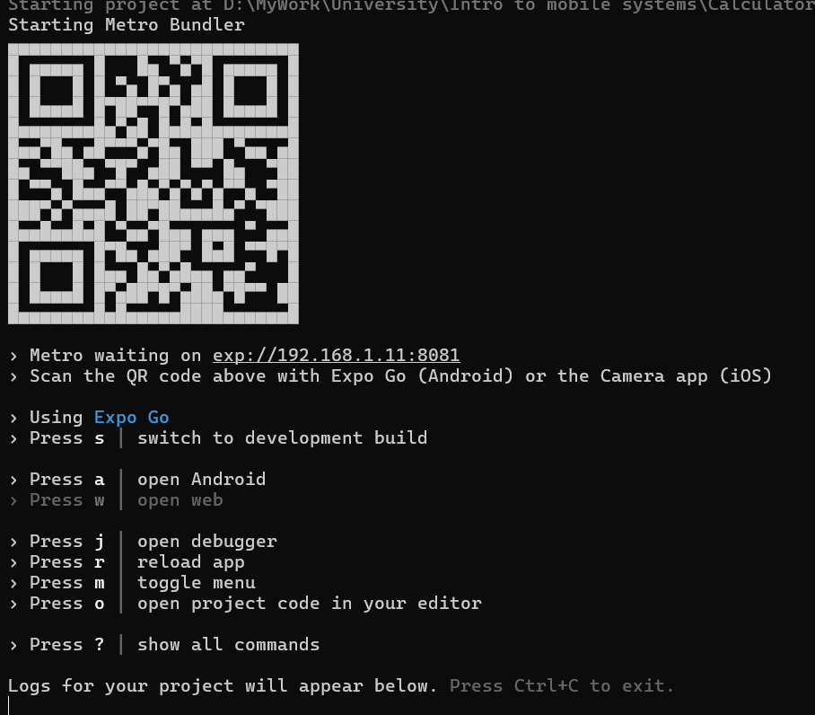

# Cafe Shop Restaurant  in React Native [University Project]


### Tech stack
- Javascript
- React Native

### Requiremenets to run the project

- Node v.20.11 or higher
- Expo Go on your android or iOS device to run the project (You can download Expo Go on Play Store/App Store)


### Running the project
- Clone the repo
- Navigate to the project folder in terminal/bash
- Run the following command to install dependencies:
```bash
$ yarn install
```
- You might get warnings about `babel` since you might have the deprecated `babel` version but you can safely ignore that
- Run the following command to run the project:
```bash
$ npx expo start
```
- Once you run the above command in the terminal/bash, you will see the following screen:

- Once the project is running, you can either enter the Metro URL on the Expo Go on your mobile device (make sure your mobile device and your computer are in the same network) OR You can SCAN the QR code to open the project directly automatically in the Expo Go
